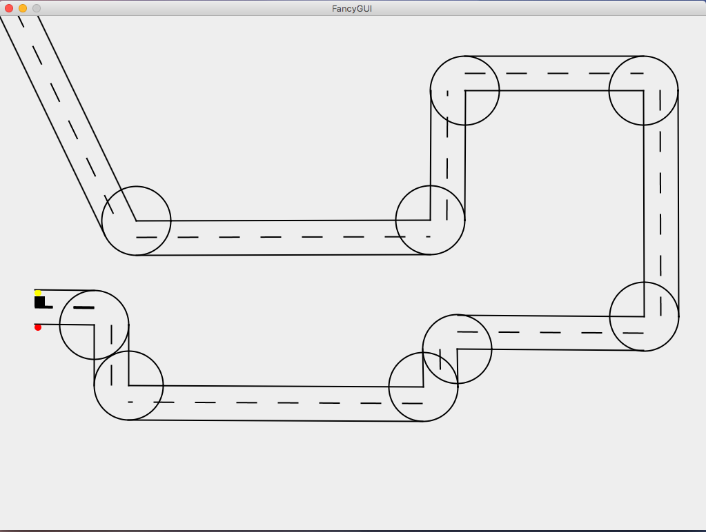

<h1>Traffic Simulator Prototype</h1>

A prototype for a traffic simulator project at uni which never kicked off. 

You can create roads by dragging the mouse (like in CitiesXL). Once the mouse is 
released, the car (a black square) drives along the path. The red and yellow circles
indicate the snapping points where the road segment can be drawn from. 

   
